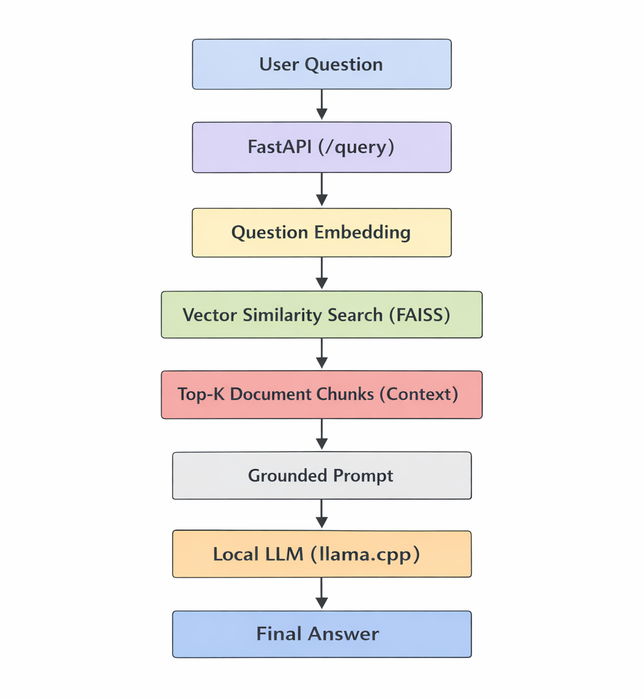
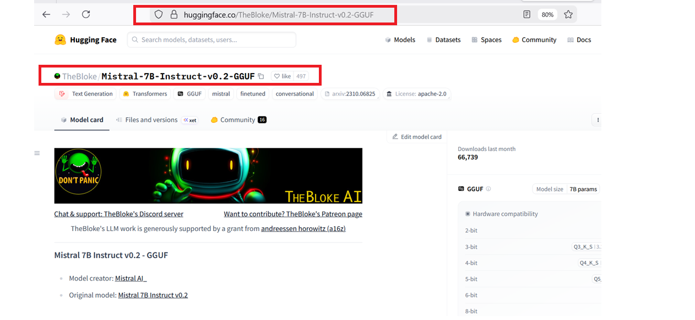
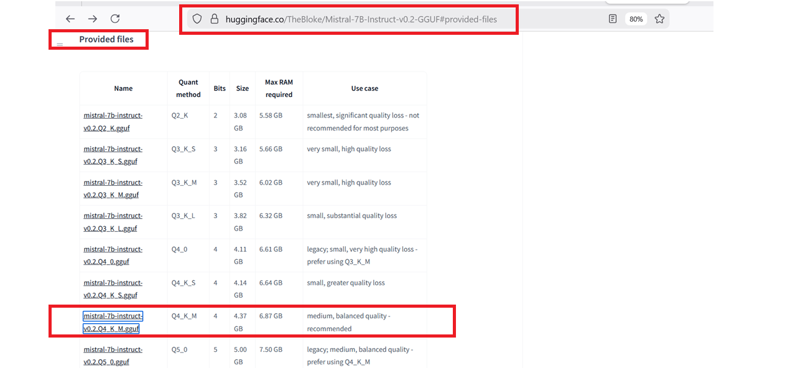
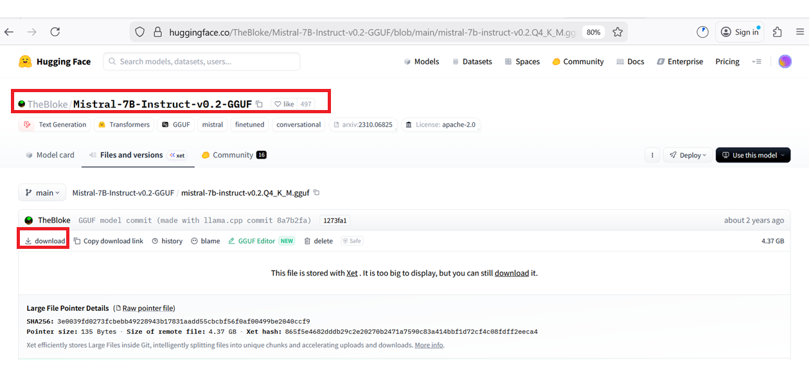

# Inhouse Document QA System

**Self-Hosted LLM + Retrieval Augmented Generation (CPU, Docker, FastAPI)**

---

## 📌 Overview

This project implements a **fully self-hosted, in-house Document Question Answering (QA) system** designed under **enterprise constraints**:

* No external LLM APIs (OpenAI, Azure, etc.)
* CPU-only execution (no GPU dependency)
* Corporate-network compatibility
* Deterministic and explainable behavior
* Explicit control over hallucinations

The system combines:

* **Local LLM inference (llama.cpp)**
* **Document ingestion and chunking**
* **Vector embeddings and semantic retrieval**
* **Retrieval Augmented Generation (RAG)**
* **FastAPI inference gateway**

All components run **locally** and can be reasoned about independently.

## 🎯 Who This Is For

This project is intended for:

- Backend engineers exploring Retrieval-Augmented Generation (RAG) systems
- ML engineers interested in **self-hosted** LLM deployments
- Teams operating under **enterprise constraints** (no cloud APIs, CPU-only)
- Developers who want to understand RAG **end-to-end**, not just use abstractions

This project is **not** intended as:
- A plug-and-play SaaS application
- A beginner-level LLM tutorial
- A high-throughput, GPU-optimized production system

---

## 🧩 Phases Completed

### ✅ Phase 1 — Self-Hosted LLM Serving

* llama.cpp HTTP server
* Quantized GGUF model (CPU-friendly)
* Dockerized deployment
* Health and readiness endpoints
* Works behind restricted corporate networks

---

### ✅ Phase 2 — FastAPI Inference Gateway *(core routing complete; metrics pending)*

* FastAPI backend
* `/query` endpoint
* Clean request/response schema
* Integration with local LLM
* Explicit timeout handling for CPU inference

> Metrics and tracing are intentionally deferred.

---

### ✅ Phase 3 — Embeddings Pipeline

* Sentence-Transformer embeddings (`all-MiniLM-L6-v2`)
* CPU-friendly execution
* Query and document embeddings
* Normalized vectors for cosine similarity

---

### ✅ Phase 4 — Vector Database & Semantic Retrieval

* FAISS in-memory vector store
* Cosine similarity search
* Top-K retrieval
* Score-based relevance interpretation

---

### ✅ Phase 5 — Retrieval Augmented Generation (RAG) Orchestration

* Manual document ingestion (TXT files)
* Overlapping chunking strategy
* Context construction
* Prompt grounding
* Hallucination prevention (“I don’t know” behavior)

This phase represents the **core system capability**.

---

## 🔜 Future Scope / Optional Phases

⬜ Phase 6 — Streamlit UI
⬜ Phase 7 — Observability, Optimization, and Scaling Notes


---

## 🧠 High-Level Architecture

## High-Level Architecture



## Query Lifecycle and Component Responsibilities

### User Input

* **Input:** Natural language question
* **Guarantee:** UTF-8 text, non-empty

---

### API Layer — FastAPI (`/query`)

* **Responsibility:** Request validation and orchestration
* **Input:** User question
* **Output:** Structured QA response

---

### Embedding Layer

* **Responsibility:** Convert question text into a vector representation
* **Input:** Question string
* **Output:** Fixed-dimension embedding vector

---

### Retrieval Layer — FAISS

* **Responsibility:** Semantic similarity search
* **Input:** Query embedding
* **Output:** Top-K ranked document chunks

---

### Context Assembly

* **Responsibility:** Prepare retrieval output for prompting
* **Input:** Ranked document chunks
* **Output:** Ordered, bounded context window

---

### Prompt Construction

* **Responsibility:** Enforce grounding constraints
* **Input:** User question + context
* **Output:** Deterministic, source-bound prompt

---

### Inference Layer — Local LLM (`llama.cpp`)

* **Responsibility:** Generate answer using provided context only
* **Input:** Grounded prompt
* **Output:** Natural language answer

---

### Response

* **Guarantee:** Answer is derived solely from internal documents
* **Failure Mode:** Explicit *“not found in documents”* response

---

### System Invariant

All generated responses must be grounded exclusively in retrieved document context. No external knowledge is permitted.


---

## 🧠 Model & Runtime

### LLM

* **Model**: Mistral 7B Instruct
* **Format**: GGUF
* **Quantization**: Q4_K_M
* **Runtime**: llama.cpp (HTTP server)
* **Execution**: CPU-only

### Embeddings

* **Model**: `sentence-transformers/all-MiniLM-L6-v2`
* **Dimensions**: 384
* **Execution**: CPU-only

---

## 📁 Document Ingestion Model

For demo and clarity purposes, documents are **manually added**.

```
documents/
├── policies.txt
├── handbook.txt
└── internal_notes.txt
```

### Ingestion Flow

1. Load `.txt` files from `documents/`
2. Split into overlapping chunks
3. Generate embeddings per chunk
4. Store embeddings in FAISS index

Documents are ingested **once at application startup**.

---

## 🔍 What “Context” Means in Responses

In RAG responses, **context** refers to:

> The top-K document chunks retrieved via vector similarity search and provided to the LLM.

Example:

```dict
"context": [
  "Internal Notes RAG System Overview...",
  "Company Policies Data Privacy Policy..."
]
```

The LLM **only sees this context**, not the entire document corpus.

---

## 📊 What “Scores” Mean

Scores are **cosine similarity values** between:

* the question embedding
* each retrieved chunk embedding

Interpretation:

* `> 0.3` → strong semantic relevance
* `~ 0.0` → weak match
* `< 0.0` → unrelated

Scores influence **retrieval ranking**, not generation.

---

## 🚫 Hallucination Control

The system is explicitly designed to **avoid hallucinations**.

If the answer is **not present in retrieved documents**, the model responds:

> **“I don’t know.”**

This is enforced via:

* Prompt constraints
* Retrieval grounding
* No external knowledge access

---

## 🧰 Technology Stack

| Layer            | Technology              |
| ---------------- | ----------------------- |
| LLM Runtime      | llama.cpp               |
| Model Format     | GGUF (quantized)        |
| Backend API      | FastAPI                 |
| Embeddings       | Sentence Transformers   |
| Vector Search    | FAISS                   |
| Containerization | Docker                  |
| Hardware         | CPU-only                |

---

## ▶️ How to Run (End-to-End)

This section walks through running the system **from scratch**.


## 0️⃣ Prerequisites

Make sure you have the following installed:

* **Git**
* **Docker + Docker Compose**
* **Python 3.11**
* **pip / virtualenv**
* (Optional) GPU can be used for experimentation, but not required

Verify:

```bash
docker --version
python --version
```

---

## 1️⃣ Clone the Repository

```bash
git clone https://github.com/VineetkumarPatil/Inhouse-Document-QA-System.git
cd Inhouse-Document-QA-System
```
---

## 2️⃣ Create Python Virtual Environment

```bash
python -m venv venv
source venv/bin/activate   # macOS / Linux
# venv\Scripts\activate    # Windows
```

Upgrade pip:

```bash
pip install --upgrade pip
```

---

## 3️⃣ Install Dependencies

```bash
pip install -r requirements.txt
```

---

## 4️⃣ Prepare the LLM Model

Download your model (example: LLaMA / Mistral-style GGUF or HF model) and place it here:

```text
models/
└── llama/
    └── models/
        └── <model-files>
```

> ⚠️ The Docker container will mount this directory.

---

## 5️⃣ Build the LLM Docker Image

From the project root:

```bash
docker build -t mistral-llama -f model/llama/Dockerfile .
```

Confirm image exists:

```bash
docker images | grep mistral-llama
```

---

## 📥 Download the LLM Model (Manual)

This project uses a **quantized GGUF model** which is **not included** in the repository due to size and licensing constraints.

### 🔗 Model Source

* **Model page:**
  [https://huggingface.co/TheBloke/Mistral-7B-Instruct-v0.2-GGUF](https://huggingface.co/TheBloke/Mistral-7B-Instruct-v0.2-GGUF)

---

### ▶️ Download Steps

1. Open the model page:

   ```
   https://huggingface.co/TheBloke/Mistral-7B-Instruct-v0.2-GGUF
   ```
   

2. Scroll down to the **“Provided files”** section:

   ```
   https://huggingface.co/TheBloke/Mistral-7B-Instruct-v0.2-GGUF#provided-files
   ```
   

3. Click on the file:

   ```
   mistral-7b-instruct-v0.2.Q4_K_M.gguf
   ```
   

4. You will be navigated to a file details page.
   Click **Download** to download the model (~4–5 GB).

---

### 📁 Place the Model in the Project

Move the downloaded file to:

```
model/llama/models/
```

Rename the file to:

```bash
model.gguf
```

Final structure:

```text
model/llama/models/
└── model.gguf
```

---

### Why `Q4_K_M`?

* Recommended balance of **quality vs size**
* Works well on **CPU-only** setups
* Ideal for **RAG / Document QA** workloads

---

### ✅ Verify (Optional)

In WSL or Linux:

```bash
ls -lh model/llama/models/model.gguf
```

Expected size: **~4–5 GB**


---
### 📝 Notes

* Model files are **not committed** to the repository
* Downloading via the Hugging Face UI avoids CLI/auth issues
* Ensure the file name is exactly `model.gguf`


---


## 6️⃣ Start LLM Server (Inference Layer)

```bash
docker run -p 8080:8080 \
  -v "/absolute/path/to/Inhouse-Document-QA-System/model/llama/models:/models" \
  mistral-llama

```

Expected logs:

```text
[LLM] Model loaded successfully
[LLM] Server listening on port 8080
```

Verify health:

```bash
curl http://localhost:8080/health
```

Expected response:

```json
{"status":"ok"}
```

### Test Model Output

```bash
curl -X POST http://localhost:8080/completion \
  -H "Content-Type: application/json" \
  -d '{
    "prompt": "Explain Retrieval Augmented Generation.",
    "n_predict": 128
  }'
```

Note: ⏳ First Request Latency

The first inference request may take longer than subsequent requests.
This is expected behavior as the model initializes internal caches
and loads weights into memory. All following requests are faster.


## 7️⃣ Ingest Start Backend API (RAG Orchestrator)

From the project root:

```bash
uvicorn backend.app.main:app --reload
```

Expected output:

```text
INFO:     Uvicorn running on http://127.0.0.1:8000
[Startup] Ingested X document chunks
```

---

## 8️⃣ Query the System

Send a query to the RAG pipeline:

```bash
curl -X POST http://127.0.0.1:8000/query \
  -H "Content-Type: application/json" \
  -d '{"question": "What is Retrieval Augmented Generation?"}'
```

Example response:

```json
{
  "answer": "Retrieval Augmented Generation (RAG) is a technique that combines..."
}
```

Access UI
```bash
http://127.0.0.1:8000/docs
```

---

## 🧪 Troubleshooting

**Port already in use**

```bash
lsof -i :8080
lsof -i :8000
```

**Docker can’t see model**

* Ensure absolute path
* Check volume mount permissions

**Slow responses**

* Enable GPU
* Reduce context size
* Use quantized model


---

## ⚙️ Performance Characteristics

* CPU inference latency: high (expected)
* Memory usage: ~7–9 GB RAM
* Throughput: suitable for demos and internal tools
* Behavior: deterministic and explainable

This system prioritizes **correctness and transparency over speed**.

---

## 📈 Why This Design

This project intentionally emphasizes:

* Explicit data flow
* Clear separation of concerns
* Enterprise realism
* Explainability over abstraction

Each component can later be replaced:

* CPU → GPU
* FAISS → managed vector database
* llama.cpp → vLLM / TGI
* Manual ingestion → automated pipelines

Without changing the RAG architecture.

This system is designed to run fully on standard CPU hardware; no special accelerators are required. Optional hardware acceleration can be used for improved performance.  

See **[DECISIONS.md](./DECISIONS.md)** for architectural details.

---

## 🧠 Key Takeaway

This project demonstrates a **production-realistic, self-hosted RAG system** that:

* Works without cloud dependencies
* Respects enterprise constraints
* Prevents hallucinations
* Is fully explainable end-to-end

---
